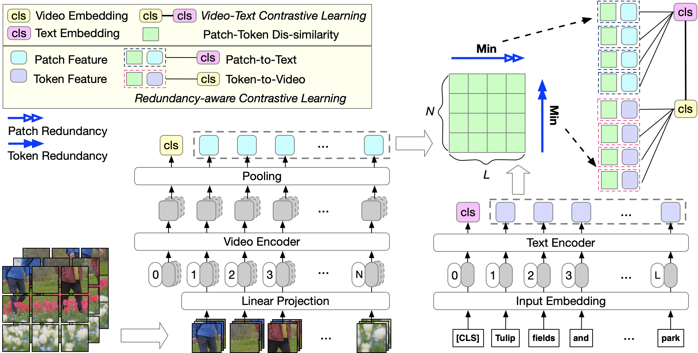

# Rap (EMNLP 22')

## Rap: Redundancy-aware Video-language Pre-training for Text-Video Retrieval



Official PyTorch code for Rap. This repository supports pre-training as well as finetuning on 
- Text-Video Retrieval on MSRVTT, DiDeMo, MSVD and LSMDC.

## Requirements
Our implementation is tested on CUDA=11.1 with NVIDIA V100 GPUs. To install the required packages:

```bash
pip install -r requirements.txt
```


## Data Preparation 
1. Pretraining dataset

    - Download WebVid-2M (see https://github.com/m-bain/webvid)
    - Put WebVid2M videos under `video_dataset/WebVid`;
    
    - Download CC-3M (see https://ai.google.com/research/ConceptualCaptions/download)
    - Change `video_dataset/cc3m/txt/cc3m.json` with local image paths.
 
2. Download raw videos of downstream datasets.

   - MSRVTT:
     - `wget https://www.robots.ox.ac.uk/~maxbain/frozen-in-time/data/MSRVTT.zip -P video_dataset; unzip video_dataset/MSRVTT.zip -d video_dataset`

    - MSVD:
      - download from official release:
  
        ```bash
        wget -nc https://www.cs.utexas.edu/users/ml/clamp/videoDescription/YouTubeClips.tar
        ```
      - check md5sum:
      
        ```bash
        9bdb20fcf14d59524a6febca9f6a8d89  YouTubeClips.tar
        ```
      - unzip all the videos to `video_dataset/msvd/videos` (1,970 videos in total).

    - DiDeMo:
       - Following [instructions](https://github.com/LisaAnne/LocalizingMoments/blob/master/README.md) and download from the official release [here](https://drive.google.com/drive/u/1/folders/1_oyJ5rQiZboipbMl6tkhY8v0s9zDkvJc);
       - unzip all the videos into `video_dataset/DiDeMo/videos`.
       - Note there might be a couple videos missing. See [here](https://github.com/LisaAnne/LocalizingMoments/blob/master/README.md#getting-the-videos) to download. However, as they account for a small portion of training set, you may feel safe to ignore.
       <!-- - Convert all the DiDeMo videos into `*.mp4` format using e.g. [`ffmpeg`](https://askubuntu.com/questions/396883/how-to-simply-convert-video-files-i-e-mkv-to-mp4). -->

    - LSDMC:
      - You must obtain permission from MPII to download and use the data. The download link is [here](https://sites.google.com/site/describingmovies/download).


3. The directory is expected to be in the structure below:
    ```bash
    .
    |-configs  # configuration files
    |-data  # dataloader file
    |-meta_data # the text description for downstream task video
    |-models
    |-transform 
    |-video_dataset # the video dataset path
    |---cc3m
    |---WebVid
    |---MSRVTT/videos
    |---LSMDC
    |---DiDeMo/videos
    |---msvd/videos
    ```
## Download official Checkpoints

  ```bash
  # pretrain Checkpoint
  wget https://huggingface.co/ffgcc/Rap_checkpoint/resolve/main/rap_pretrain.pth
  # msrvtt7k finetune Checkpoint
  wget https://huggingface.co/ffgcc/Rap_checkpoint/resolve/main/rap_msrvtt7k_finetune.pth
  # didemo finetune Checkpoint
  wget https://huggingface.co/ffgcc/Rap_checkpoint/resolve/main/rap_didemo_finetune.pth
  # msvd finetune Checkpoint
  wget https://huggingface.co/ffgcc/Rap_checkpoint/resolve/main/rap_msvd_finetune.pth
  # lsmdc finetune Checkpoint
  wget https://huggingface.co/ffgcc/Rap_checkpoint/resolve/main/rap_lsmdc_finetune.pth
  ```

## Inference with Official Checkpoints

Set eval=1 to inference Checkpoints

Get the finetune result
  ```bash
  
  bash run_retrieval.sh msrvtt7k rap_msrvtt7k_finetune.pth 1
  # {'vid_r1': 38.5, 'vid_r5': 64.0, 'vid_r10': 74.4, 'vid_mdR': 3.0}
  bash run_retrieval.sh didemo rap_didemo_finetune.pth 1
  # {'vid_r1': 42.9, 'vid_r5': 71.2, 'vid_r10': 80.2, 'vid_mdR': 2.0}
  bash run_retrieval.sh msvd rap_msvd_finetune.pth 1
  # {'vid_r1': 45.4, 'vid_r5': 74.8, 'vid_r10': 83.6, 'vid_mdR': 2.0}
  bash run_retrieval.sh lsmdc rap_lsmdc_finetune.pth 1
  # {'vid_r1': 19.7, 'vid_r5': 39.0, 'vid_r10': 47.2, 'vid_mdR': 13.0}
  ```
Get the zero-shot result
  ```bash
  
  bash run_retrieval.sh msrvtt7k rap_pretrain.pth 1
  # {'vid_r1': 28.9, 'vid_r5': 47.5, 'vid_r10': 56.8, 'vid_mdR': 7.0}
  bash run_retrieval.sh didemo rap_pretrain.pth 1
  # {'vid_r1': 29.5, 'vid_r5': 55.7, 'vid_r10': 65.6, 'vid_mdR': 4.0}
  bash run_retrieval.sh msvd rap_pretrain.pth 1
  # {'vid_r1': 35.9, 'vid_r5': 64.3, 'vid_r10': 73.7, 'vid_mdR': 3.0}
  bash run_retrieval.sh lsmdc rap_pretrain.pth 1
  # {'vid_r1': 12.8, 'vid_r5': 26.6, 'vid_r10': 33.4, 'vid_mdR': 37.0}
  ```


## Pretraining 

  ```bash
  #We use 64 V100 (CUDA=11.1) train Rap. Here is a test script. You can change it to a multi-node version.
  bash test_pretrain.sh
  ```

## Finetuning
Set eval=0 to finetune pretrain checkpoint
  ```bash
  bash run_retrieval.sh msrvtt7k rap_pretrain.pth 0

  bash run_retrieval.sh didemo rap_pretrain.pth 0

  bash run_retrieval.sh msvd rap_pretrain.pth 0

  bash run_retrieval.sh lsmdc rap_pretrain.pth 0
  ```


## Acknowledgement
We thank members at Salesforce Research for their helpful discussions.

The implementation of Rap relies on resources from [ALRPO](https://github.com/salesforce/ALPRO), [ClipBERT](https://github.com/jayleicn/ClipBERT),[BLIP](https://github.com/salesforce/BLIP),
[TCL](https://github.com/uta-smile/TCL), The code is implemented using [PyTorch](https://github.com/pytorch/pytorch), We thank the original authors for their open-sourcing and encourage Rap users to cite their works when applicable.

